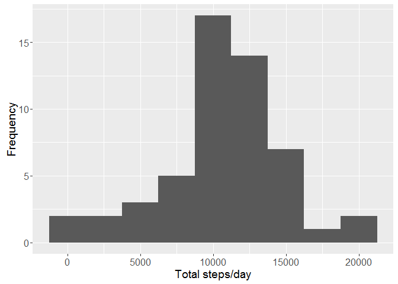
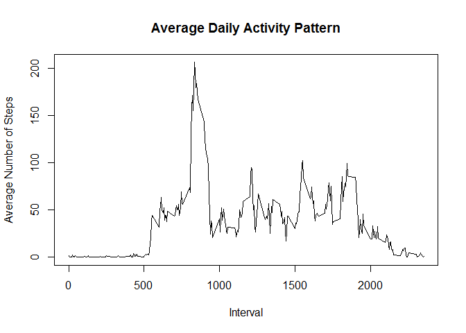
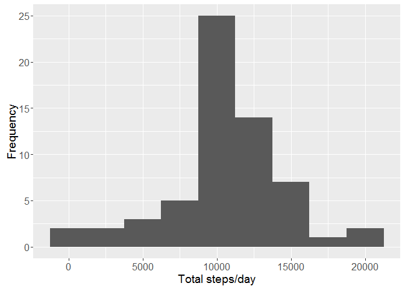

# Project 1
Carlos Siri  
June 26, 2016  

1. Load the Data


```r
setwd("C:/Users/siricar/Documents/R")
data <- read.csv("activity.csv", header = TRUE, sep = ",", na.strings = "NA")
```


2. Process/transform the data (if necessary) into a format suitable for your analysis


```r
summary(data)
```

```
##      steps                date          interval     
##  Min.   :  0.00   2012-10-01:  288   Min.   :   0.0  
##  1st Qu.:  0.00   2012-10-02:  288   1st Qu.: 588.8  
##  Median :  0.00   2012-10-03:  288   Median :1177.5  
##  Mean   : 37.38   2012-10-04:  288   Mean   :1177.5  
##  3rd Qu.: 12.00   2012-10-05:  288   3rd Qu.:1766.2  
##  Max.   :806.00   2012-10-06:  288   Max.   :2355.0  
##  NA's   :2304     (Other)   :15840
```

```r
str(data)
```

```
## 'data.frame':	17568 obs. of  3 variables:
##  $ steps   : int  NA NA NA NA NA NA NA NA NA NA ...
##  $ date    : Factor w/ 61 levels "2012-10-01","2012-10-02",..: 1 1 1 1 1 1 1 1 1 1 ...
##  $ interval: int  0 5 10 15 20 25 30 35 40 45 ...
```

```r
head(data)
```

```
##   steps       date interval
## 1    NA 2012-10-01        0
## 2    NA 2012-10-01        5
## 3    NA 2012-10-01       10
## 4    NA 2012-10-01       15
## 5    NA 2012-10-01       20
## 6    NA 2012-10-01       25
```

```r
data$date <- as.Date(data$date, format = "%Y-%m-%d")
data$interval <- factor(data$interval)
```

For this part of the assignment, you can ignore the missing values in the dataset.

```r
library (dplyr)
```

```
## Warning: package 'dplyr' was built under R version 3.2.5
```

```
## 
## Attaching package: 'dplyr'
```

```
## The following objects are masked from 'package:stats':
## 
##     filter, lag
```

```
## The following objects are masked from 'package:base':
## 
##     intersect, setdiff, setequal, union
```

```r
NA_index <- is.na(as.character(data$steps))
data_no_NA <- data[!NA_index,]

Day <- data_no_NA%>% group_by(date) %>%
          summarize(total.steps = sum(steps, na.rm = T), 
                  mean.steps = mean(steps, na.rm = T))
```

3. Calculate the total number of steps taken per day

4. Make a histogram of the total number of steps taken each day

```r
library(ggplot2)
```

```
## Warning: package 'ggplot2' was built under R version 3.2.4
```

```r
g <- ggplot(Day, aes(x=total.steps))
g + geom_histogram(binwidth = 2500) + theme(axis.text = element_text(size = 12),  
      axis.title = element_text(size = 14)) + labs(y = "Frequency") + labs(x = "Total steps/day")
```



5. Calculate and report the mean and median of the total number of steps taken per day

```r
summary(Day$total.steps)
```

```
##    Min. 1st Qu.  Median    Mean 3rd Qu.    Max. 
##      41    8841   10760   10770   13290   21190
```

What is the average daily activity pattern?

1. Make a time series plot (i.e. ???????????????? = "????") of the 5-minute interval (x-axis) and the average number of steps taken, averaged across all days (y-axis)

```r
#Calculating the average
steps_per_interval <- aggregate(data_no_NA$steps, by=list(interval=data_no_NA$interval), FUN=mean)

#Adding columns names
colnames(steps_per_interval) <- c("interval", "average_steps")

#ploting the average daily activity pattern 
plot(as.integer(levels(steps_per_interval$interval)), steps_per_interval$average_steps, type="l",
     xlab = "Interval", ylab = "Average Number of Steps", main = "Average Daily Activity Pattern")
```




2. Which 5-minute interval, on average across all the days in the dataset, contains the maximum number of steps?

```r
#The maximum number of average steps
max_steps <- max(steps_per_interval$average_steps)
max_steps
```

```
## [1] 206.1698
```

Imputing missing values

Note that there are a number of days/intervals where there are missing values (coded as ????????). The presence of missing days may introduce bias into some calculations or summaries of the data.

1. Calculate and report the total number of missing values in the dataset (i.e. the total number of rows with ????????s)


```r
sum(is.na(data))
```

```
## [1] 2304
```

2. Devise a strategy for filling in all of the missing values in the dataset. The strategy does not need to be sophisticated. For example, you could use the mean/median for that day, or the mean for that 5-minute interval, etc.


```r
#finding the indices of missing values (NAs)
NA_index <- which(is.na(as.character(data$steps)))
complete_data <- data
#Imputing missing values using the mean for that 5-minute interval
complete_data[NA_index, ]$steps<-unlist(lapply(NA_index, FUN=function(NA_index){
                steps_per_interval[data[NA_index,]$interval==steps_per_interval$interval,]$average_steps
                }))
```

3. Create a new dataset that is equal to the original dataset but with the missing data filled in.


```r
#Checking the complete data with the summary and str methods
summary(complete_data)
```

```
##      steps             date               interval    
##  Min.   :  0.00   Min.   :2012-10-01   0      :   61  
##  1st Qu.:  0.00   1st Qu.:2012-10-16   5      :   61  
##  Median :  0.00   Median :2012-10-31   10     :   61  
##  Mean   : 37.38   Mean   :2012-10-31   15     :   61  
##  3rd Qu.: 27.00   3rd Qu.:2012-11-15   20     :   61  
##  Max.   :806.00   Max.   :2012-11-30   25     :   61  
##                                        (Other):17202
```


```r
str(complete_data)
```

```
## 'data.frame':	17568 obs. of  3 variables:
##  $ steps   : num  1.717 0.3396 0.1321 0.1509 0.0755 ...
##  $ date    : Date, format: "2012-10-01" "2012-10-01" ...
##  $ interval: Factor w/ 288 levels "0","5","10","15",..: 1 2 3 4 5 6 7 8 9 10 ...
```

4. Make a histogram of the total number of steps taken each day and Calculate and report the mean and median total number of steps taken per day. Do these values differ from the estimates from the first part of the assignment? What is the impact of imputing missing data on the estimates of the total daily number of steps?


```r
new <- complete_data %>% group_by(date) %>%
      summarize(total.steps = sum(steps, na.rm = T))

g <- ggplot(new , aes(x=total.steps))
g + geom_histogram(binwidth = 2500) + theme(axis.text = element_text(size = 12),
      axis.title = element_text(size = 14)) + labs(y = "Frequency") + labs(x = "Total steps/day")
```




```r
summary (Day$total.steps)
```

```
##    Min. 1st Qu.  Median    Mean 3rd Qu.    Max. 
##      41    8841   10760   10770   13290   21190
```

```r
summary (new$total.steps)
```

```
##    Min. 1st Qu.  Median    Mean 3rd Qu.    Max. 
##      41    9819   10770   10770   12810   21190
```

the main differences are going to be in the 1st quartile. because we are using the mean per interval, it will mainly affect the lower quartile.

Are there differences in activity patterns between weekdays and weekends?

For this part the ????????????????????????????????() function may be of some help here. Use the dataset with the filled-in missing values for this part.

1. Create a new factor variable in the dataset with two levels - "weekday" and "weekend" indicating whether a given date is a weekday or weekend day.

    

```r
#Creating a factor variable "day "to store the day of the week:
complete_data$day <- as.factor(weekdays(complete_data$date))

#Creating a logical variable "is_weekday" (weekday=TRUE, weekend = FALE) :
complete_data$is_weekday <- ifelse(!(complete_data$day %in% c("Saturday","Sunday")), TRUE, FALSE) 


#Calculating the average number of steps for weekdays
weekdays_data <- complete_data[complete_data$is_weekday,]
steps_per_interval_weekdays <- aggregate(weekdays_data$steps, by=list(interval=weekdays_data$interval), FUN=mean)


#Calculating the average number of steps for weekends
weekends_data <- complete_data[!complete_data$is_weekday,]
steps_per_interval_weekends <- aggregate(weekends_data$steps, by=list(interval=weekends_data$interval), FUN=mean)

#Adding columns names
colnames(steps_per_interval_weekdays) <- c("interval", "average_steps")
colnames(steps_per_interval_weekends) <- c("interval", "average_steps")
#Adding a column to indecate the day
steps_per_interval_weekdays$day <- "Weekday"
steps_per_interval_weekends$day <- "Weekend"

#Merging the two togather
week_data <- rbind(steps_per_interval_weekends, steps_per_interval_weekdays)
#Converting the day variabke to a factor
week_data$day <- as.factor(week_data$day)

#Making the plot
library(lattice)
xyplot(average_steps ~  interval | day, data = week_data, layout = c(1,2), type ="l", ylab="Number of Steps")
```


